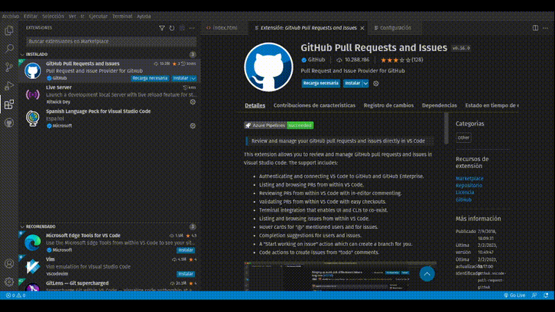

# Creando un proyecto en Astro

```
npm create astro@latest
```

<figure><figcaption></figcaption></figure>

Luego de lanzar el comando Astro empieza a crear el proyecto y nos va haciendo preguntas  donde  le decimos  a Astro que instale las dependencias,  luego le damos la ruta donde queremos que quede ubicado el proyecto, posteriormente elegimos la plantilla con la que queremos arrancar nuestro poryecto.


Astro posee un servidor de desarrollo que tiene todo lo que necesitas para desarrollar tu proyecto. El comando `astro dev` iniciará el servidor de desarrollo local para que veas tu nuevo proyecto en acción por primera vez.

Cada plantilla de inicio posee un script preconfigurado que ejecutará `astro dev` por ti. Utiliza tu gestor de paquetes favorito para ejecutar este comando e iniciar el servidor de desarrollo de Astro.


```
npm run dev
```

¡Si todo marcha bien, Astro deberá servir tu proyecto localmente en [http://localhost:3000](http://localhost:3000)!

Astro escuchará cualquier cambio en la carpeta `src/` y actualizará automáticamente tu proyecto. De esta forma, no será necesario reiniciar el servidor local durante el desarrollo.

Si no es posible abrir el proyecto en el navegador, regresa a la terminal donde has ejecutado el comando `dev` y chequea si ha ocurrido algún error o si tu proyecto está siendo servido en una URL diferente a la mencionada anteriormente.

<figure><figcaption></figcaption></figure>

Ahora tenemos el proyecto creado y corriendo el  localhost, para  empezar a alterar el código, podemos hacer el reto que nos ponen en la plantilla, "Para empezar, abre el directorio src/pages en tu proyecto. Reto de código: Modifica el mensaje "Bienvenido a Astro" anterior."
