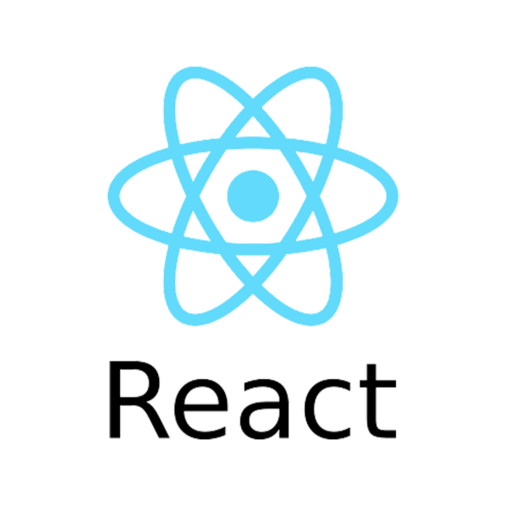

# Introducción a React

## Qué es react

[React](https://es.reactjs.org/) es una [librería](https://devcamp.es/que-es-libreria-programacion/) (también llamada biblioteca) de javascript que permite crear interfaces gráficas de usuario (también llamada GUI \[insertar link]). Es decir, es un conjunto de piezas de código que ayudan en la creación de entornos gráficos para uso de las personas.&#x20;

La característica principal de React es permitir mejorar la experiencia de uso al no necesitar cargar toda la página desde cero cuando se necesita efectuar algún cambio en la información que se debe representar.

\[inserte imagen sobre interfaces]\
\
En este caso, React es la herramienta que permite crear la aplicación web que interactúa con los contratos inteligentes.

### Cómo funciona

React permite agrupar diferentes elementos de la interfaz gráfica (tales como botones, formularios, barras de navegación) y separarlos en fragmentos llamados "componentes"&#x20;

\[inserte imagen sobre componentes]

Estos componentes se pueden reutilizar y combinar para crear interfaces u otros componentes más complejos. Internamente, React se encarga de representar en pantalla todos estos componentes y actualizarlos cuando sea necesario.

### Cómo se usa

Para crear aplicaciones con React se necesita primero instalar NodeJs. \[link] Esta herramienta nos permite ejecutar el entorno de desarrollo necesario para crear las aplicaciones web con react.&#x20;

Este entorno de desarrollo se encarga de crear un servidor local que permite ver en tiempo real los cambios en el código. También, comprime el código final para que tenga una carga más óptima a la hora de visualizar en el navegador web.&#x20;

Adicionalmente, estos entornos de desarrollo junto al código de la aplicación se almacenan en un formato especial llamado _Repositorio._
